voir ce site pour ajouter les droits sur les ports https://arduino.stackexchange.com/questions/21215/first-time-set-up-permission-denied-to-usb-port-ubuntu-14-04
pour activer le port ttySO (uart du rpi), ajouter dans le fichier /boot/firmware/config.txt à la fin enable_uart=1
activer hotspot
lancer les bonnes commande dans /etc/rc.local
Pour voir les erreurs dans rc.local -> systemctl status rc-local.service
installer miniconda :https://github.com/conda-forge/miniforge/#download

Pour installer open3d sur ubuntu 20.10 arm: http://www.open3d.org/docs/latest/arm.html
sudo apt-get update -y
sudo apt-get install -y apt-utils build-essential git cmake
sudo apt-get install -y python3 python3-dev python3-pip
sudo apt-get install -y xorg-dev libglu1-mesa-dev
sudo apt-get install -y libblas-dev liblapack-dev liblapacke-dev
sudo apt-get install -y libsdl2-dev libc++-7-dev libc++abi-7-dev libxi-dev
sudo apt-get install -y clang-7
pip install cmake
# Clone
git clone --recursive https://github.com/isl-org/Open3D
cd Open3D
git submodule update --init --recursive
mkdir build
cd build

cmake -DCMAKE_BUILD_TYPE=Release -DBUILD_SHARED_LIBS=ON -DBUILD_CUDA_MODULE=OFF -DBUILD_GUI=OFF -DBUILD_TENSORFLOW_OPS=OFF -DBUILD_PYTORCH_OPS=OFF -DBUILD_UNIT_TESTS=ON -DCMAKE_INSTALL_PREFIX=~/open3d_install -DPYTHON_EXECUTABLE=$(which python3) -DUSE_BLAS=ON -DBUILD_FILAMENT_FROM_SOURCE=ON -DCMAKE_CXX_FLAGS_RELEASE=ON -DCMAKE_CXX_FLAGS_RELEASE="-O3 -DNDEBUG -faligned-new"  \    ..
make -j 1 (essayer sans ça)
make install-pip-package -j 1


Free stationing of a robotic total station by RTK drone
=======================================================
Setting up a total station can in some cases be very time consuming, for example in a city with not enough known coordinates points or in a forest. In these situations, surveyors usually measure a few points on the ground with a GNSS rover (in RTK mode) and use these points afterwards to set up the total station. However, there are a risks of setting up a device on poorly measured points due to multipath (in cities) or poor GNSS coverage (in forests or urban corridor). The new method we propose uses a quadcopter drone (UAV) equipped with a GNSS receiver in RTK mode (10Hz frequency) and a mini prism 360, with the total station measuring the UAV at a 10Hz frequency. The whole system is automatically controlled by a Raspberry Pi developed in Python (free license) which creates a server accessible from a smartphone allowing the operator to follow and control the acquisition, have good information of precision and reliability. Furthermore, the 3D coordinates of the free station are automatically calculated and pushed to the total station to set the new coordinates and orientation of the instrument. Finally, a result file designed to apprehend the quality of the set up of the instrument is created. Once this process is completed, the total station is ready to measure with its new stationing. The usage of the drone allows positioning in places where GNSS coverage is better than at ground level. In order to make the system work in real time, all that is required is a SIM card, the connection information for the RTK correction network and a Leica Geosystems robotic total station. Problems such as time synchronisation and communication between the different parts of the system had to be solved by various methods.

This prototype has been put to experiment in the swiss projection system and the precision obtained are under the centimetre for the 3D coordinates and under \(1/1000\) of gradian for the orientation of the total station. This system will ensure a position for a total station in places with not enough known coordinates points such as forests, alpine places but also developing countries. Furthermore, this all-in-one solution gives the opportunity to set up an instrument in a poor GNSS coverage place at ground level with the possibility to rise above the obstructions with the drone. A free station can be set up in almost all environments in under 5 minutes.

Hardware and material needed
----------------------------

Besides the total station and the UAV, the concept is to obtain a functionning system with some basic, cheap and accesible material.

In this chapter, all the material we used for this prototype is detailed.

1. Leica Geosystems robotic total station
    - Piezo technology motorisation in order to have a faster follow-up of the UAV
    - GeoCom compatible, to be able to send commands to the instrument
    - Leica MS60 used for this prototype

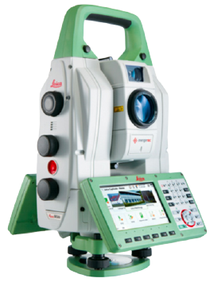

2. Quadcopter drone (UAV)
    - Manually operated
    - Possibility of attaching a bracket for the antenna
    - DJI Inspire 2 used for this prototype

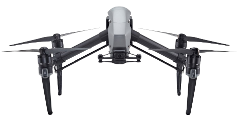

3. antenna and prism support
    - Metallic mount used to attach the support to the UAV
    - 3D printed support
    - GNSS antenna fixed on top of the support
    - Prism screwed underneath the support


4. Mini-prism 360
    - Directly attached to the support (3)

5. 3D printed support for the UBlox radio transmitter and Cellular chip

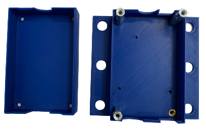

6. CellularLine PowerBank

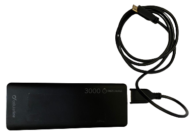

7. Complete radio antenna mounted on the UAV
    - UBlox processor
    - ArduiSimple (Je sais pas trop ce que c'est)
    - Tellit cellular chip
    - XBee XS868

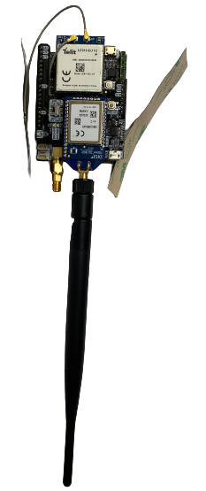

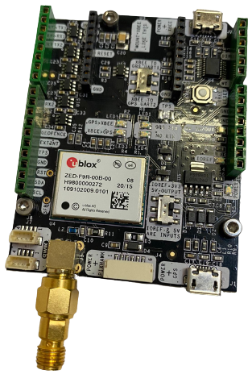

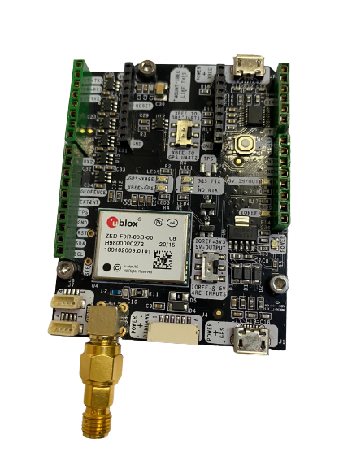

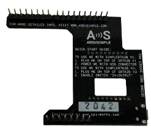

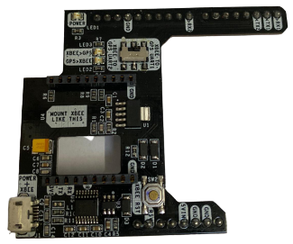


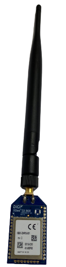

8. UBlox ANN-MB series
    - mounted on the prism and antenna support
    - multi-band (L1, L2/E5b/B21) high resolution antenna
    - support GPS, GLONASS, Galileo and Beidou

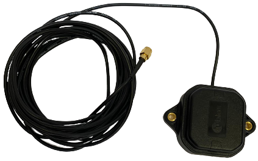

10. RaspberryPI4
    - RaspberryPi4 (all the code is stored there)
    - XBee SX868 (radio communication with the other radio mounted on the UAV, getting the GNSS data)

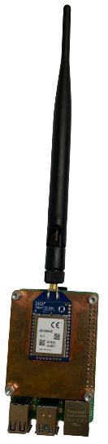

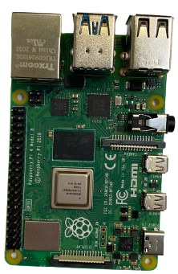


Assembly
--------

The assembly process is divided in 3 parts. The first part is mounted on the drone and consists of two 3D printed support used for the GNSS measurements and the mounting of the mini-prism 360.

First, a part has top be mounted on the front of the UAV. This part has to be on top of the UAV because the GNSS antenna is fixed on this support. The solution we used on the DJI Inspire 2 is two threaded rod glued to the drone. This part is the point 3 of the previous chapter.

We used the same method to attach the second 3D printed part.

Software
--------

The software is divided in 5 separated codes.

The main one : __app.py__ is used to create the Flask server and create the sockets.
The Flask server has five different routes :

1. The first one is used to create the homepage. The index.html file is the template for the web page.
```python
@app.route("/")
def index():
    init_file()
    return render_template('index.html')
```

2. The second one is used for the acquisition of the GNSS and total station data. This page calls the second code __Drone_RTK_RPI_thread.py__, detailed below.
    - Etapes du process

```python
@app.route("/acquisition/", methods=['POST'])
def acquisition():
    try:
        os.remove('ICP.png')
    except:
        print('no ICP graph to remove')
    try:
        os.remove('retour.pdf')
    except:
        print('no pdf to remove')
    init_file()
    drone.start_acquisition()
    return render_template('index.html', info = 'Acquisition en cours voir les boutons pour le statut.');
```

3. The third one is about the calculation of the coordinates of the total station and the quality indicators related to the stationning and the acquisition. This one calls the following codes : __Drone_RTK_RPI_thread.py__, __test_write_pdf.py__
    - Etapes du process

```python
@app.route("/calcul/", methods=['POST'])
def calcul():
    global AcquiType
    AcquiType = request.form['AcquisType']#'STAT' ou 'DYN'
    print(AcquiType)
    ecart_antenne_prisme = int(request.form['ecart'])/1000
    global x_res, y_res, z_res, g0, fitness, inlier_rmse, len_correspondence, img
    x_res,y_res,z_res,g0, fitness, inlier_rmse, len_correspondence, P_global, P_local = drone.start_calcul(ecart_antenne_prisme,AcquiType)
    img = create_plot(float(x_res), float(y_res), P_global, P_local)
    pdf.write_pdf(AcquiType, x_res, y_res, z_res, g0, fitness, inlier_rmse, len_correspondence)
    return render_template('index.html', res_E = str(x_res), res_N = str(y_res), res_H = str(z_res), res_g0 = str(g0), res_fitness = fitness, res_rmse = inlier_rmse, res_corres = len_correspondence, image = img);
```

4. The fourth page is used for the stationning of the total station. The coordinates and the orientation are sent to the instrument and the total station sets a new stationning.
    - Etapes du process

```python
@app.route("/redo/", methods=['POST'])
def redo():
    bool_test_st = drone.SetNewStation(x_res,y_res,z_res,g0)
    if bool_test_st == True :
        pass
    else :
        while bool_test_st == False :
            bool_test_st = drone.SetNewStation(x_res,y_res,z_res,g0)
    return render_template('index.html', res_E = str(x_res), res_N = str(y_res), res_H = str(z_res), res_g0 = str(g0), res_fitness = fitness, res_rmse = inlier_rmse, res_corres = len_correspondence, image = img);
```

5. The last page has the function to download and display the PDF result file.

```python
@app.route('/download/')
def download():
    path = 'retour.pdf'
    return send_file(path, as_attachment=True)
```

The second one includes all the function used for the acquisition and the calculations. This one is called __Drone_RTK_RPI_thread.py__.

Let's take a look at the main thread on this code.

```python
with open('temp_info.json','w') as file_info:
    info_acquis_dict =  { "GPS_connect" : "NO", "Tacheo_connect" : "NO", "RTK" : "NO", "Prisme_lock_and_compensateur" : "NO", "Enregistrement_des_points" : "NO", "Nombre_GPS" : '0', "Echelle" : "0"}
    file_info.seek(0)  # rewind
    json.dump(info_acquis_dict,file_info)
    file_info.truncate()
    logging.info("Thread %s: starting", name)
    init_txtFile(obs_filename)
    portXbee = '/dev/ttyS0'
    portTacheo = '/dev/ttyUSB0'
    facteur_echelle = 0
    start_time = 0
    end_time = 0
    time_GPS = 0
    block = True
    nb_points_GPS = 0
    count_without_GPS = 0
    ser_GPS = False; bool_tacheo = False
    TS = com.GeoCom(portTacheo,115200,1.0,1.0)
    print(f'{bcolors.WARNING}[Warning] RTK position is not yet available.{bcolors.ENDC}')
    while not ser_GPS or not bool_tacheo:
        if not ser_GPS:
            ser_GPS = openXbee(portXbee,115200)
        if ser_GPS:
            info_acquis_dict['GPS_connect'] = 'OK'
            file_info.seek(0)
            json.dump(info_acquis_dict,file_info)
            file_info.truncate()
        if not bool_tacheo :
            bool_tacheo = openTacheo(TS)
        if bool_tacheo:
            info_acquis_dict['Tacheo_connect'] = 'OK'
            file_info.seek(0)
            json.dump(info_acquis_dict,file_info)
            file_info.truncate()
    ser_GPS.reset_input_buffer()
    print(f'{bcolors.OKGREEN}[INFO] Total station and Xbee GPS are connected and open.{bcolors.ENDC}')
    while 1 :
        while facteur_echelle == 0 :
            data_GPS = ask4observationGPS(ser_GPS)
            if data_GPS and data_GPS != 'GGA':
                info_acquis_dict['RTK'] = 'OK'
                E, N, h = projection_for_f(float(data_GPS[0][0]),float(data_GPS[0][1]),float(data_GPS[0][2]))
                facteur_echelle =((float(N)-1200000)**2/(2*(6378800**2)))-(float(h)/6378800)+1
                print(f'{bcolors.OKGREEN}[INFO] Facteur d\'echelle calcule : {bcolors.ENDC}',facteur_echelle)
                info_acquis_dict['Echelle'] = format(facteur_echelle,'.6f')
            else:
                print(f'{bcolors.OKGREEN}[INFO] Calcul du facteur d\'echelle, si trop long, probleme de RTK.{bcolors.ENDC}')
                info_acquis_dict['RTK'] = 'NO'
            file_info.seek(0)
            json.dump(info_acquis_dict,file_info)
            file_info.truncate()
        data_GPS = ask4observationGPS(ser_GPS)
        data_tacheo = ask4observationTacheo(TS, ser_GPS)
        if data_GPS and data_GPS != 'GGA':
            count_without_GPS = 0
            print(f'{bcolors.OKGREEN}[INFO] GPS RTK OK.{bcolors.ENDC}')
            info_acquis_dict['RTK'] = 'OK'
            time_GPS = float(data_GPS[1])
            start_time = float(data_GPS[2])
            if not block:
                writeDataGps(obs_filename,data_GPS)
                nb_points_GPS +=1
            block = False
        elif data_GPS == 'GGA':
            block = True
            print(f'{bcolors.OKGREEN}[INFO] GPS non RTK.{bcolors.ENDC}')
            info_acquis_dict['RTK'] = 'FLOAT'
        elif not data_GPS:
            count_without_GPS+=1
            if count_without_GPS>20:
                print(f'{bcolors.WARNING}[Warning] No GPS data, verify GPS.{bcolors.ENDC}')
                info_acquis_dict['GPS_connect'] = 'NO'
                info_acquis_dict['RTK'] = 'NO'
                block = True
        if data_tacheo != False :
            end_time = float(data_tacheo[3])
            time = time_GPS + end_time - start_time
            if not block:
                writeDataTacheo(obs_filename,data_tacheo,format(time,".3f"),facteur_echelle)
                print(f'{bcolors.OKGREEN}[INFO] Prisme locke, enregistrement des points actif.{bcolors.ENDC}')
                info_acquis_dict["Enregistrement_des_points"] = 'OK'
            info_acquis_dict["Prisme_lock_and_compensateur"] = 'OK'
            block = False
        else:
            block = True
            print(f'{bcolors.WARNING}[Warning] Prisme non locke ou compensateur hors tolerance, enregistrement des points inactif.{bcolors.ENDC}')
            info_acquis_dict["Prisme_lock_and_compensateur"] = 'NO'
            info_acquis_dict["Enregistrement_des_points"] = 'NO'
        file_info.seek(0)
        info_acquis_dict['Nombre_GPS'] = str(nb_points_GPS)
        json.dump(info_acquis_dict,file_info)
        file_info.truncate()
logging.info("Thread %s: finishing", name)
```
# Prepare the Raspberry Pi 4
Download PiImager https://www.raspberrypi.com/software/
Choose OS : Other general purpose OS/Ubuntu/Ubuntu Desktop 21.10
Choose the SD card to be formatted and write (min 16Gb)
Finish installation : insert SD card in raspberry, connect screen, mouse and keyboard (or more tricky with ssh connection from other computer: see on web)
connect wifi or ethernet
Open a terminal (CTL+ALT+T):

### MiniConda

#### To get MiniConda installation on Raspberry Pi 4, see : [installing MiniConda](https://github.com/conda-forge/miniforge/)
To download Miniconda : (https://github.com/conda-forge/miniforge/releases/latest/download/Miniforge3-Linux-aarch64.sh)

wget https://github.com/conda-forge/miniforge/releases/latest/download/Miniforge3-Linux-aarch64.sh

chmod +x Miniforge3-Linux-aarch64.sh

./Miniforge3-Linux-aarch64.sh

yes/yes

close terminal an reopen a terminal

#### Create an environment
conda create -n drone python=3.8

proceed? yes

conda activate drone

#### Install automatic free station github project :
cd /Desktop --
mkdir drone --
cd drone --
git clone (mettre futur url)

#### rc.local configure

cd /etc

sudo nano rc.local

copy past :
  #!/bin/bash
  cd /home/[USER]/Desktop/drone/code
  source /home/[USER]/miniforge3/etc/profile.d/conda.sh
  conda activate drone
  python app.py
  #exit 0
CTRL+X, yes enter

#### Enable UART ports
sudo usermod -a -G dialout $USER

sudo chmod a+rw /dev/ttyS0

(add in file /boot/firmware/config.txt at the end enable_uart=1)

cd /boot/firmware

nano config.txt go to the end and write a new line with

enable_uart=1

#### Install libraries :
pip install open3d flask flask_socketio matplotlib pyserial julian colorama fpdf

#### Configure Wifi hotspot
en haut à droite, se souvenir des informations de connexion
Noter l'adresse IP du RPI

sudo nano /etc/NetworkManager/system-connections/Hotspot.nmconnection

set autoconnect=false to autoconnect=true

#### Library dependecies
Complete with libraries not installed
conda activate drone
pip install time numpy ...
Python as an open source programmation language has an ocean of libraries. This prototypes uses several of them.

To simply install any library, in a python console use the command
```pip install```

1. time : Measure various process time (already installed on Miniconda)
2. numpy : Various mathemtaics operations and arrays 
3. serial :
    - for the pip install command use ```pip install pyserial```
4. math : Various mathematics operations (already installed on Miniconda)
5. logging : logging system (already installed on Miniconda)
6. multiprocessing : threading 
7. json : reading and writing Json files (already installed on Miniconda)
8. datetime : getting and saving dates and time
    - datetime
    - timezone
9. julian : getting julian date for the GeoCom part
10. matplotlib.figure : plotting graphs after free stationning is done
    - Figure
11. matplotlib.backends.backend_agg :
    - FigureCanvasAgg
12. flask : creating server
    - Flask
    - render_template
    - Response
    - request
    - redirect
    - url_for
    - send_file
13. io : reading and writing files saved into the computer (already installed on Miniconda)
14. base64 : encoding binary data to printable ASCII (already installed on Miniconda)
15. os : various operating system functionality (already installed on Miniconda)
16. open3d : 3D point cloud calculations
17. copy : deepcopies of python objects (already installed on Miniconda)
18. fpdf : creating pdf result file 

